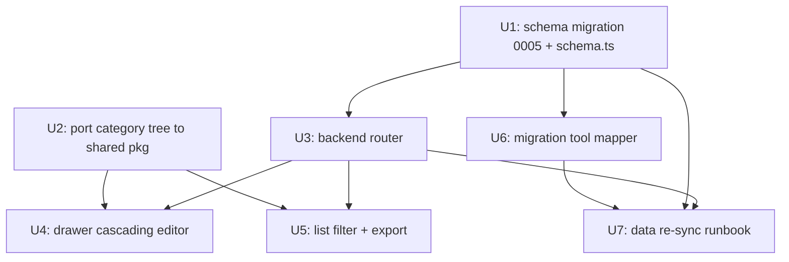

# feat: Sync benchmark-admin to legacy V3 category dimension + data re-sync

**Target repo:** Smilexuhc/benchmark-repo (admin code under `benchmark-admin/`)

## Summary

Legacy benchmark (PRs #43/#44) added a three-level **V3 category** dimension to `video_benchmark_items` — `category_l1`, `category_l2`, `category_l3`, `category_definition` — wired into its API, made it the primary list filter, and shipped a 60+ leaf cascading category tree (`frontend/src/data/questionTypeOptions.ts`). benchmark-admin has none of this. This plan brings admin to full parity with legacy on the category dimension (schema → API → frontend), extends the migration tool to carry the new columns, and re-syncs admin data from a legacy-identical database (clear admin, reload from legacy) so the two systems are consistent.

Old fields (`shot_type`/`task_type`/`question_type`/`manual_tag`) are retained — the V3 change is additive in legacy, and admin mirrors that.

## Problem Frame

benchmark-admin was migrated from legacy before the V3 category work landed. As a result:
- Admin cannot store, display, edit, filter, or export the V3 categories legacy now treats as the primary classification.
- The already-migrated 105 items in the new DB have no category data.
- Legacy has also gained more rows since the last admin backfill.

Goal (user-stated): **consistency with legacy**. On all three open questions from the prior investigation the user chose "match legacy": port the full cascading category tree, and swap the list's primary filter to category as legacy did.

## Requirements

- **R1.** `video_benchmark_items` in admin gains `category_l1`, `category_l2`, `category_l3`, `category_definition` (all `TEXT NOT NULL DEFAULT ''`) plus a composite index on `(category_l1, category_l2, category_l3)`, matching legacy migration `0015`.
- **R2.** Admin API (read/list/create/update/export) round-trips the four category fields, and list supports category filtering + search, matching legacy `backend/db.py` field sets.
- **R3.** Admin frontend edits categories via a cascading l1→l2→l3 selector sourced from a port of legacy's `questionTypeOptions.ts`, with the definition auto-derived from the selected leaf.
- **R4.** Admin list filter mirrors legacy: primary filter is category (`category_l1/l2/l3`); list rows/export surface category.
- **R5.** The legacy→admin migration tool (PR #41) copies the four category columns straight across.
- **R6.** Admin data is re-synced from a legacy-identical DB (truncate admin item-side tables + idempotent reload) so admin rows — including categories and any rows added since last backfill — match legacy. Owner-confirmed: legacy V3 backfill has already run, so legacy source rows carry populated categories.

## Key Technical Decisions

- **KTD1 — Categories are free `TEXT` columns at the DB layer, not an enum/FK.** Legacy models them as plain `TEXT` and the valid-value set is enforced only in the UI via the option tree. Admin mirrors this: cheap, exactly matches legacy storage, and keeps the migration a straight column copy. The category tree is the UI source of truth for valid values, not a DB constraint. *(Matches legacy `0015`; avoids a divergent constraint admin would have to keep in sync.)*
- **KTD2 — Port the full category tree as shared data, not per-surface duplication.** Legacy's `questionTypeOptions.ts` is the authoritative tree (l1→l2→l3 + code + definition). Port it once into the admin shared package so server (validation/labels if needed) and web (cascading selector, definition lookup) consume one copy. *(User chose full parity; single source avoids drift.)*
- **KTD3 — Reuse the existing cascading-select pattern.** `BenchmarkList.tsx` already implements a parent→child cascade (`shotType` select resets `questionType`, child disabled until parent chosen). Extend the same pattern to a 3-level category cascade in both the list filter and the drawer rather than inventing a new widget.
- **KTD4 — Re-sync via the idempotent migration tool, not hand-written SQL.** The tool (PR #41) already does a transactional truncate+load with built-in parity verification. Extending its mapper and re-running it is safer and more auditable than ad-hoc category backfill SQL, and it naturally picks up rows legacy added since the last backfill. *(Owner delegated data backfill to the DB agent, who has env vars.)*
- **KTD5 — Keep old classification fields.** `shot_type/task_type/question_type/manual_tag` stay in schema, API, and migration. Legacy kept them; dropping them in admin would be a different (unrequested) divergence and would break the existing stats grouping.

## High-Level Technical Design

Dependency flow across the implementation units:

Legacy `video_benchmark_items` (post-#43) vs admin (post-this-plan): identical scalar category surface; admin continues to model media via `video_benchmark_media_links` (intentional RF-2 decoupling, already handled by the tool).

## Implementation Units

### U1. Schema: add V3 category columns + index

- **Goal:** Admin DB and Drizzle schema gain the four category columns and the composite index.
- **Requirements:** R1
- **Dependencies:** none
- **Files:**
  - `benchmark-admin/packages/shared/src/db/schema.ts` (add `categoryL1/L2/L3`, `categoryDefinition` to `videoBenchmarkItems`; add `index('idx_vbi_category').on(l1,l2,l3)`)
  - `benchmark-admin/drizzle/migrations/0005_add_video_benchmark_categories.sql` (new; generated via drizzle-kit, mirrors legacy `0015`)
  - `benchmark-admin/drizzle/migrations/meta/*` (drizzle journal/snapshot updates)
- **Approach:** Add four `text(...).notNull().default('')` columns and the composite index to the `videoBenchmarkItems` table builder, then generate the migration with the project's drizzle-kit script. Confirm generated SQL matches legacy `0015` shape (columns + `idx_video_benchmark_items_category` equivalent). No constraint on values (KTD1).
- **Patterns to follow:** existing `difficulty` column addition (`0004_add_difficulty.sql`) and the index declarations already in `videoBenchmarkItems`.
- **Test scenarios:**
  - Migration applies cleanly on a fresh DB and is idempotent on re-run (columns/index use `IF NOT EXISTS` semantics or drizzle equivalent).
  - After migration, inserting a row without category fields yields `''` defaults (not null).
  - `Test expectation:` schema/migration unit — covered by the migration applying in the U3/U7 integration tests rather than a dedicated unit test.
- **Verification:** `drizzle-kit` generates no further diff against `schema.ts`; migration runs in the admin test DB; columns + index present.

### U2. Port legacy category tree into the admin shared package

- **Goal:** A single authoritative copy of the V3 category tree (l1→l2→l3, code, definition) available to admin server + web.
- **Requirements:** R3, R2 (labels)
- **Dependencies:** none
- **Files:**
  - `benchmark-admin/packages/shared/src/benchmark/categoryTree.ts` (new — port of legacy `frontend/src/data/questionTypeOptions.ts`)
  - `benchmark-admin/packages/shared/src/benchmark/__tests__/categoryTree.test.ts` (new)
  - shared package barrel/index export as the repo convention dictates
- **Approach:** Copy the nested tree verbatim from legacy `questionTypeOptions.ts` (keep `value`/`label`/`code`/`definition`/`children` shape, or adapt names to admin conventions but preserve content exactly). Add small helpers: `leafByPath(l1,l2,l3)` and `definitionFor(l1,l2,l3)` so the drawer can auto-fill `category_definition` from the selected leaf. This must stay byte-faithful to legacy content — it is the parity contract.
- **Patterns to follow:** other static data/config in `packages/shared`.
- **Test scenarios:**
  - Tree round-trips: every node has `code` + `value`; every leaf has a non-empty `definition`.
  - `definitionFor` returns the exact leaf definition for a known path (e.g., `单镜头 / 提示词遵循/参考绑定 / 核心文本指令遵循`) and `''` for an unknown path.
  - Leaf count and l1 set match legacy `questionTypeOptions.ts` (guards against a partial port).
- **Verification:** counts/spot-checks equal legacy; consumed by U4/U5 without duplication.

### U3. Backend: round-trip categories in read/list/create/update + filter/search + stats

- **Goal:** Admin tRPC benchmark router fully supports the category fields, matching legacy `db.py` field sets.
- **Requirements:** R2, R4
- **Dependencies:** U1
- **Files:**
  - `benchmark-admin/packages/server/src/routers/benchmark.ts`
  - `benchmark-admin/packages/server/src/routers/__tests__/benchmark.test.ts`
  - export builder + `benchmark-admin/packages/server/src/routers/__tests__/exports.test.ts`
- **Approach:**
  - Add `categoryL1/L2/L3`, `categoryDefinition` to `ItemScalars` (defaults `''`) so create/update accept and persist them.
  - Extend `list` filter input with `categoryL1/L2/L3` (optional) and add equality conditions mirroring the existing `shotType/taskType/questionType` handling; add the category columns to the search `OR` (like legacy `VIDEO_BENCHMARK_SEARCH_FIELDS`).
  - Include the four columns in list/detail selects and in the export column set (legacy adds them to its export field list).
  - Stats parity: legacy moved its primary grouping toward categories; update the stats `groupBy` (currently `shotType, questionType`) to also expose category grouping. Keep old grouping unless it conflicts — confirm against legacy stats output during implementation (execution-time detail).
- **Patterns to follow:** existing `shotType`/`questionType` filter + search wiring in the same file (lines ~239–287), `ItemScalars` (~214), stats groupBy (~477–495).
- **Test scenarios:**
  - Create item with category fields → read back returns them verbatim.
  - Update item changes only category fields; other scalars untouched.
  - `list` filtered by `categoryL1` returns only matching rows; filter by full l1+l2+l3 narrows correctly; empty filter returns all.
  - Search term matching a `category_l3` or `category_definition` substring returns the row (parity with legacy search fields).
  - Export of a filtered slice includes the four category columns with correct values.
  - Edge: item with empty categories (`''`) is not matched by a non-empty category filter and serializes as `''` not null.
- **Verification:** router tests green; manual tRPC call shows category round-trip; export contains category columns.

### U4. Frontend: cascading category editor in the item drawer

- **Goal:** Reviewers can set l1→l2→l3 in `BenchmarkDrawer`, with definition auto-shown/stored.
- **Requirements:** R3
- **Dependencies:** U2, U3
- **Files:**
  - `benchmark-admin/apps/web/src/components/benchmark/BenchmarkDrawer.tsx`
  - `benchmark-admin/apps/web/src/components/benchmark/__tests__/BenchmarkDrawer.test.tsx`
- **Approach:** Add three dependent selects fed by the U2 tree: choosing l1 populates l2 options and clears l2/l3; choosing l2 populates l3 and clears l3; choosing l3 sets `category_definition` from the leaf. Persist all four on save via the U3 create/update inputs. Show the definition (read-only) under the l3 select for reviewer context, matching legacy drawer behavior (`BenchmarkItemDrawer.tsx`).
- **Patterns to follow:** the existing cascade in `BenchmarkList.tsx` (`onChange` of parent resets child, child `disabled` until parent set); existing field components under `components/drawers/shared/Field.tsx`.
- **Test scenarios:**
  - Selecting l1 enables l2 and resets any stale l2/l3.
  - Selecting a full path sets and displays the correct definition.
  - Editing an existing item pre-selects its stored l1/l2/l3 and shows its definition.
  - Saving sends all four category fields in the mutation payload.
  - Edge: item with empty categories renders empty selects with no definition and saves `''` without error.
- **Verification:** drawer tests green; manual create/edit persists categories visible after reload.

### U5. Frontend: list category filter, column, and export parity

- **Goal:** List filtering mirrors legacy (category as primary filter), and category is visible in rows/export.
- **Requirements:** R4
- **Dependencies:** U2, U3
- **Files:**
  - `benchmark-admin/apps/web/src/components/benchmark/BenchmarkList.tsx`
  - `benchmark-admin/apps/web/src/components/benchmark/__tests__/` (list filter test, new or existing)
- **Approach:** Add a cascading category filter (l1→l2→l3) wired to the U3 list filter input and to the export params (export already mirrors the viewed slice). Match legacy's choice to make category the primary classification filter; per user direction ("跟legacy一致") follow legacy's filter layout — if legacy replaced shot/task/question with category in the filter bar, do the same, keeping shot/question available only where legacy still shows them. Surface category (at least l3, or l1/l3) in the row layout where legacy shows it.
- **Patterns to follow:** existing `useQueryStates` filter state (lines ~37–43), filter `onChange` cascade (~162–177), export params block (~117–123).
- **Test scenarios:**
  - Selecting category l1/l2/l3 updates the query state and the list request filters.
  - Changing l1 resets l2/l3 in the filter.
  - Export request carries the active category filter.
  - Row renders category value (non-empty) and `—` when empty.
- **Verification:** list filters by category end-to-end against a seeded DB; export reflects filter.

### U6. Migration tool: carry category columns through the mapper

- **Goal:** The legacy→admin tool copies `category_l1/l2/l3/category_definition` to admin items.
- **Requirements:** R5
- **Dependencies:** U1
- **Files:**
  - `benchmark-admin/tools/migrate-from-legacy/src/mappers.ts` (PR #41 branch `feat/ben7-legacy-data-migration`)
  - `benchmark-admin/tools/migrate-from-legacy/src/mappers.test.ts`
  - tool README parity-field list
- **Approach:** Add the four columns to the item-scalar mapping (straight passthrough, default `''` when legacy value is null). Include them in the tool's built-in parity verification so a mismatch fails loudly. Fold into PR #41 (preferred, since it is unmerged) or a follow-up commit on the same branch.
- **Patterns to follow:** existing scalar field mapping for `shot_type/question_type/difficulty` in the same mapper; existing parity-check assertions.
- **Test scenarios:**
  - Mapper maps a legacy row with populated categories → admin row with identical four fields.
  - Legacy null/absent category → admin `''`.
  - Parity check flags a deliberately mismatched category as a failure.
- **Verification:** `mappers.test.ts` green; tool `--dry-run` reports category fields in the diff.

### U7. Data re-sync runbook: clear admin + reload from legacy-identical DB

- **Goal:** Admin data matches legacy (categories populated; rows added since last backfill included).
- **Requirements:** R6
- **Dependencies:** U1, U3, U6
- **Files:** none (operational runbook; executed by the DB agent with env vars)
- **Approach:**
  1. Precondition: U1 migration applied to the NEW (admin) DB; owner has provided the legacy-identical source DB connection string. Confirm legacy source rows carry populated categories (owner says backfill done).
  2. Run the migration tool `--dry-run` first; review parity report (row counts, category fields, media links).
  3. Run `--execute`: transactional truncate of admin item-side tables + reload (tool is idempotent/atomic; legacy stays read-only). This naturally subsumes the prior 105-row load and adds new legacy rows.
  4. Run the tool's parity verification; assert zero category mismatches, expected counts, no dangling links.
- **Approach notes / safety:** Backups/connection details are operational; do not deploy until parity passes. This step runs **before** deployment per the issue thread.
- **Test scenarios:** `Test expectation: none` — operational step; correctness is asserted by the tool's parity verification (U6) and a post-load spot check (sample N items: categories equal legacy).
- **Verification:** parity report clean; spot-check sample items in admin equal legacy for all four category fields and core scalars.

## Scope Boundaries

**In scope:** schema + API + frontend + migration-tool support for the V3 category dimension, and the data re-sync to consistency.

**Out of scope / not changing:**
- Media model (`video_benchmark_media_links`) — intentional decoupling, already handled.
- `difficulty` — already in sync (admin `0004`).
- Dropping or renaming old classification fields — legacy kept them; admin keeps them (KTD5).

### Deferred to Follow-Up Work
- **Deployment** — explicitly sequenced after this work per the issue ("先完成这个之后再做部署"). Deploy still depends on the separate GitHub Actions secrets blocker (CR_*/ECS_* secrets), which is owner-side and tracked in the issue thread.
- Backfilling category fields onto any admin-only rows created directly in admin (if any exist that are not in legacy) — re-sync from legacy is the chosen consistency model, so admin-only rows are out of the consistency contract.

## Risks & Dependencies

- **Data re-sync is destructive to admin item tables (truncate+reload).** Mitigation: tool is transactional and idempotent, legacy is read-only, dry-run + parity verification gate the execute; run before deploy. Take a NEW-DB snapshot before `--execute`.
- **Partial tree port (U2)** would silently lose valid values. Mitigation: leaf-count/l1-set parity test against legacy.
- **PR #41 is unmerged.** U6 must land on that branch (or it merges first). Sequencing note, not a blocker.
- **Legacy source categories must actually be populated.** Owner confirmed the V3 backfill ran; U7 step 1 re-confirms via dry-run before execute.
- **Stats grouping parity (U3)** depends on exactly what legacy now groups by — resolve by reading legacy stats output at implementation time.

## Sequencing

U1 → (U2 ∥ U3) → (U4 ∥ U5); U6 after U1 (folds into PR #41); U7 last, after U1+U3+U6 and after owner provides the legacy-identical DB. Deployment follows the whole plan.

## Test / Verification Strategy

- Unit + integration tests per unit (vitest), especially router round-trip (U3) and tree parity (U2).
- The authoritative data check is the migration tool's parity verification against the real legacy-identical DB (U7) — stronger than synthetic fixtures.
- Manual UI pass: create/edit an item's categories, filter the list by category, export a filtered slice.
