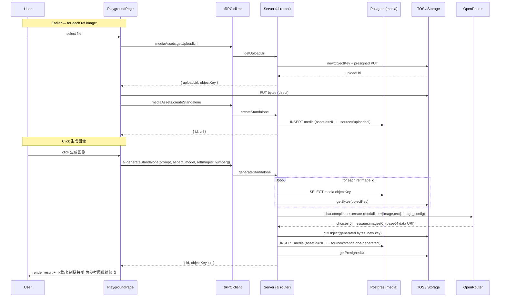

# feat: Standalone Image Playground in benchmark-admin

## Summary

Add a standalone "生图" (image generation) workbench page to `benchmark-admin`, accessible from the top `Segmented` navigation, that lets a logged-in user upload reference images, choose an aspect ratio, write a prompt, and generate an image — without binding the result to any character/scene/prop asset. Generated images and uploaded references are persisted to `media` with `assetId = NULL`. Single-turn form UX, no chat history (decision recorded in **Option A** below).

Reuses the existing image-gen pipeline (`services/ai/generateImage` → OpenRouter `chat.completions` with `modalities: ["image","text"]` → TOS upload). Two surgical extensions: the AI service accepts multiple ref images (`Buffer[]` instead of single `Buffer`) and an optional model override; the media-assets router gains a `createStandalone` procedure that inserts `media.assetId = NULL` without creating a placeholder asset.

PR split: PR1 = server (ai service + two new tRPC procedures + tests), PR2 = web (new `/playground` route, page, nav entry, component tests). See **Implementation Units** below.

---

## Problem Frame

Users currently can only generate images from inside a character/scene/prop drawer, where every generation is tied to a specific asset. They want a **scratch surface** to:

- Try prompts and reference images without polluting the asset library.
- Iteratively edit an image ("修改上传图片季节 改为冬天") by uploading it as a ref and rewriting the prompt.
- Hand the finished image off elsewhere by downloading or copying the link.

This is **single-turn**: each click is an independent request. The illusion of multi-turn editing is supported via a "use this result as a new reference image" action that pushes the generated image back into the ref slot for the next click.

---

## Requirements

Carried from the BEN-24 issue thread (no upstream brainstorm doc exists; the issue thread is the origin record):

- **R1.** A logged-in user can reach a new "生图" page via the top-level `Segmented` nav, alongside 角色 / 场景 / 道具 / 题目.
- **R2.** The page lays out (top to bottom): reference-image area (multi-image with thumbnails + "click to add" upload slot), model selector (locked to `gpt-image-2`), aspect-ratio selector (`16:9`, `1:1`, `3:2`, `2:3`, `9:16`), prompt textarea, "生成图像" button, result area.
- **R3.** Generation works with **zero** reference images (text-to-image) and with **1–4** reference images (image-to-image).
- **R4.** Switching aspect ratio changes the output dimensions accordingly.
- **R5.** Both the uploaded reference images and the generated result are persisted as `media` rows with `assetId = NULL`. Reference uploads use `source = 'uploaded'`; generated results use `source = 'standalone-generated'`. `mediaType = 'image'` in both cases.
- **R6.** Only `gpt-image-2` is selectable in v1; the zod enum rejects any other model.
- **R7.** Result area exposes: 下载, 复制图片链接, and 作为参考图继续修改 (pushes the result into the ref-image list).
- **R8.** OpenRouter failure modes (401, 402/insufficient credit, abort) surface as friendly Chinese error text via the existing `translateError` path.

---

## Key Technical Decisions

### KTD1. Persist standalone media as `media` rows with `assetId = NULL`

`packages/shared/src/db/schema.ts:55-56` explicitly comments that `media.assetId is nullable` to support standalone files. No DB migration required. Standalone uploads use `source = 'uploaded'`, standalone generations use `source = 'standalone-generated'` (a new free-form string — `media.source` carries no CHECK constraint; the only CHECK is on `media_type`).

**Rationale.** Reuses the storage + presign + soft-delete machinery already in place. A separate `standalone_images` table would duplicate the same columns and add no value at v1's feature scope. If we later want a "history of standalone generations" view, the query is `SELECT … FROM media WHERE asset_id IS NULL AND source = 'standalone-generated'`.

### KTD2. Add `mediaAssets.createStandalone` rather than reuse `mediaAssets.create`

The existing `mediaAssets.create` (router lines 186-215) **always creates a placeholder `assets` row** to satisfy a non-null `media.assetId` in its original use case (binding a freshly uploaded file to a brand-new asset for the benchmark item editor). Reusing it for the playground would leave orphan `assets` rows behind — that is the "垃圾行" anti-pattern called out during scoping.

The new procedure is ~15 lines: take `objectKey` + `mediaType` + `filename`, insert one `media` row with `assetId = NULL` + `source = 'uploaded'`, return `{ id, objectKey, url }` with a presigned URL. Existing `create` is left untouched.

### KTD3. Extend `services/ai/generateImage` to accept `Buffer[]` and an optional `model`

`packages/server/src/services/ai/index.ts:102-106` currently signs `generateImage(prompt, refImageBytes?: Buffer, aspectRatio?)`. Change to:

```ts
generateImage(
  prompt: string,
  refImageBytes?: Buffer[],          // was: Buffer
  aspectRatio?: string,
  model?: string,                    // new; defaults to env.IMAGE_MODEL
): Promise<{ objectKey: string }>
```

The content array (when refs are present) loops and pushes one `image_url` part per `Buffer`. `model` is passed straight through to `openai.chat.completions.create({ model: model ?? env.IMAGE_MODEL, … })`. The whitelist (`'gpt-image-2'` only) is enforced one layer up at the zod schema in the router, not here — the service stays a thin pass-through.

**Migration of existing callers.** Three sites use `generateImage` today (character / scene / prop generate-image; scene generate-view): all pass a single `Buffer` or nothing. Update each call site to wrap the single buffer in an array (`[refBytes]`) — three trivial edits in `packages/server/src/routers/ai.ts`. No semantic change for those callers.

**Rationale.** `Buffer[]` is the minimum change that supports the UI. The model parameter exists because the screenshot shows a "模型选项" dropdown — even though v1 has one option, the plumbing is in place and the locked-down enum lives at the contract edge (router) rather than buried in the service.

### KTD4. Single-turn form UX, not multi-turn chat

The screenshot is a form (upload zone + dropdowns + prompt + one button); there is no message list. We do **not** persist a conversation, do **not** pass prior turn history to OpenRouter, and do **not** render a chat surface. Continuous iteration is supported by the 作为参考图继续修改 button on the result, which copies the result back into the ref slot for the next click. Effect is equivalent to a multi-turn img2img edit loop without the chat scaffolding.

If a real multi-turn UX is wanted later, that's a separate plan: conversation storage, message thread component, OpenRouter context-window management. Out of scope here.

### KTD5. Route name `/playground`; nav label "生图"

Matches the user's confirmed naming. `playground` is the codebase-side identifier (consistent with TanStack file-based routing convention, easy to find later). 生图 is the user-facing label in the top `Segmented`.

### KTD6. Frontend uses `react-hook-form` for the form, separate `useState` for the ref-image list

The form fields (prompt, model, aspectRatio) are flat values that round-trip cleanly through `react-hook-form` — matches the convention in `CharacterDrawer`/`SceneDrawer`/`PropDrawer`. The reference-image list is **not** a form value: it carries per-image upload state (uploading / uploaded / failed) and is mutated by async upload callbacks. Keeping it in a parallel `useState<RefImage[]>` keeps the form's dirty/validity semantics clean and avoids contorting `useFieldArray` for upload state.

---

## High-Level Technical Design

End-to-end flow for a single "生成图像" click with N uploaded reference images already present:



The two new procedures (`mediaAssets.createStandalone`, `ai.generateStandalone`) are thin compositions over storage + db + the (extended) `services/ai/generateImage`. No worker, no queue, no background job — the existing synchronous long-running HTTP pattern with the 600s timeout already covers this surface.

---

## Scope Boundaries

### In scope (v1)

- One new client route `/playground`, one new tRPC procedure on `ai`, one new tRPC procedure on `mediaAssets`, one signature change on `services/ai/generateImage` with three trivial caller updates.
- Persistence of standalone media via `assetId = NULL` rows.
- Multi-ref images, capped at 4.
- Single fixed model `gpt-image-2`; five fixed aspect ratios.
- 下载 / 复制图片链接 / 作为参考图继续修改 actions on the result.

### Out of scope (explicit non-goals, not deferred — different products)

- Multi-turn chat UX (separate plan if ever wanted; see KTD4).
- Standalone-generation **history list** page — v1 only shows the most recent result in-session. Persistence is for future-proofing (KTD1), not v1 UX.
- "Convert this standalone image into a character/scene/prop asset" workflow.
- Per-image regenerate from history.
- Mass / batch standalone generation.
- Configurable model registry — the white-listed enum is hard-coded for now.

### Deferred to follow-up work

- Adding a second selectable model — straightforward extension to the zod enum + dropdown items list when needed.
- "My standalone generations" history page if users ask for it; the data is already in `media` after v1.
- Local-only ref images (uploaded to OpenRouter without going through TOS) — would need an alternate code path in `generateStandalone` that bypasses `media`. Defer until there's evidence the persist-everything default is wasteful.

---

## Implementation Units

PR boundary: U1–U4 ship in PR1 (server). U5–U7 ship in PR2 (web) and depend on PR1 being merged.

---

### U1. Extend `services/ai/generateImage` to multi-ref + optional model

**Goal.** Allow zero, one, or many reference images per call and let the caller name the model. Migrate existing callers minimally.

**Requirements.** R3 (multi-ref), R6 (model selectable — plumbing only at this layer).

**Dependencies.** None.

**Files:**

- `benchmark-admin/packages/server/src/services/ai/index.ts` — change `refImageBytes: Buffer` to `refImageBytes?: Buffer[]`; add `model?: string` param; default to `env.IMAGE_MODEL`; loop refs into the content array.
- `benchmark-admin/packages/server/src/routers/ai.ts` — three caller updates (lines 31–72 `generateImage` mutation, plus any scene `generate-view` style sites if present) to wrap the single buffer as `[refBytes]`.
- `benchmark-admin/packages/server/src/services/ai/__tests__/ai.test.ts` — extend with multi-ref test scenarios.

**Approach.**

- Build content array as: `[{ type: 'text', text: prompt }, ...refs.map(b => ({ type: 'image_url', image_url: { url: 'data:image/png;base64,' + b.toString('base64') } }))]`.
- When `refs` is undefined or empty, content stays the plain `prompt` string (current behavior).
- Pass `model: model ?? env.IMAGE_MODEL` into `openai.chat.completions.create`.
- Keep the `imageLimit` p-limit wrapper untouched.

**Execution note.** Test-first for the multi-ref content shape — small contract change is easy to verify with a `vi.mock` on the OpenRouter client and an assertion on the `messages[0].content` array.

**Patterns to follow.** Match the existing `_generateImage` body shape; no new abstractions, no new helpers, no new error classes. The existing `translateError` import already handles OpenRouter failures.

**Test scenarios** (`packages/server/src/services/ai/__tests__/ai.test.ts`):

- Prompt only, no refs → `content` sent to OpenRouter is the prompt string, not an array.
- Prompt + 1 ref → `content` is an array with one text part and one `image_url` part with the expected base64 data URI prefix.
- Prompt + 3 refs → `content` is an array with one text part and three `image_url` parts, in caller order.
- `aspectRatio` provided → `image_config.aspect_ratio` equals the override.
- `aspectRatio` omitted → `image_config.aspect_ratio` equals `env.IMAGE_ASPECT_RATIO`.
- `model` provided → request `model` field equals the override.
- `model` omitted → request `model` field equals `env.IMAGE_MODEL`.
- OpenRouter throws → error is rethrown via `translateError` (covered by an existing assertion shape; extend if not present for the multi-ref path).
- Empty prompt → throws `提示词为空，无法生成图片` (preserved from current code).

**Verification.** All previously-passing tests in this file remain green after the signature change. New scenarios pass.

---

### U2. Add `mediaAssets.createStandalone` procedure

**Goal.** Persist an uploaded object key as a `media` row with `assetId = NULL`, without creating a placeholder `assets` row.

**Requirements.** R5 (uploaded refs persisted, no asset binding), KTD2.

**Dependencies.** None.

**Files:**

- `benchmark-admin/packages/server/src/routers/media-assets.ts` — add the new procedure after the existing `create` (around line 215).
- `benchmark-admin/packages/server/src/routers/__tests__/media-assets.test.ts` — new test block.

**Approach.**

- Input: `z.object({ objectKey: z.string().min(1), mediaType: z.enum(['image','audio','video']).default('image'), filename: z.string().default('') })`.
- Insert one `media` row: `assetId = null`, `objectKey`, `source = 'uploaded'`, `mediaType = input.mediaType`.
- After insert, call `storage.getPresignedUrl(objectKey)` and return `{ ...row, url }`.
- Do not touch `assets`.

**Patterns to follow.** Mirror the trailing half of the existing `create` (lines 200-214) for the insert + presign + return shape. Imports already in scope.

**Test scenarios** (`packages/server/src/routers/__tests__/media-assets.test.ts`):

- Happy path: caller invokes with a valid `objectKey` → response has a numeric `id`, the inserted `media` row has `assetId IS NULL`, `source === 'uploaded'`, `mediaType === 'image'`.
- `mediaType` defaults to `'image'` when omitted.
- Empty `objectKey` → zod rejects.
- Calling `createStandalone` does **not** insert any row into `assets` (assert `assets` row count unchanged before/after).
- Returned `url` is the presigned URL produced by the mocked `storage.getPresignedUrl` (assert it matches the mock's `cdn.example.com/${key}` shape).

**Verification.** New test file scenarios pass; existing `media-assets.test.ts` scenarios remain green.

---

### U3. Add `ai.generateStandalone` procedure

**Goal.** Accept prompt + aspectRatio + model + ref media ids, run image generation, persist result as a standalone media row, return `{ id, objectKey, url }`.

**Requirements.** R3 (multi-ref), R4 (aspect), R5 (persist result with `assetId = NULL`, `source = 'standalone-generated'`), R6 (model whitelist enforced at the contract edge), R8 (friendly errors via `translateError`).

**Dependencies.** U1 (multi-ref signature on `services/ai/generateImage`).

**Files:**

- `benchmark-admin/packages/server/src/routers/ai.ts` — append a new mutation after `generateImage` (after line 72).
- `benchmark-admin/packages/shared/src/schemas/prompts.ts` — add `GenerateStandaloneImageInput` zod schema next to the existing `GenerateImageInput` (line 29).
- `benchmark-admin/packages/server/src/routers/__tests__/ai-router.test.ts` — new `describe('generateStandalone', …)` block.

**Approach.**

- Schema (in `prompts.ts`):
  ```ts
  GenerateStandaloneImageInput = z.object({
    prompt: z.string().min(1),
    aspectRatio: z.enum(['16:9','1:1','3:2','2:3','9:16']).default('16:9'),
    model: z.enum(['gpt-image-2']).default('gpt-image-2'),
    refImages: z.array(z.number().int().positive()).max(4).optional(),
  })
  ```
- Mutation body:
  1. If `refImages` is non-empty: `SELECT objectKey FROM media WHERE id IN (…) AND deletedAt IS NULL`. Order results by the order of the input ids. Reject (400) if any id is missing.
  2. For each found row, `storage.getBytes(objectKey)` → `Buffer[]`.
  3. Call `ai.generateImage(prompt, refBuffers, aspectRatio, model)`.
  4. Insert one `media` row: `assetId = null`, `objectKey = <generated>`, `source = 'standalone-generated'`, `mediaType = 'image'`. If the insert fails, best-effort `storage.deleteObject(objectKey)` (mirrors the existing `generateImage` cleanup pattern at lines 60-66).
  5. `storage.getPresignedUrl(objectKey)`; return `{ id, objectKey, url }`.

**Patterns to follow.** The error/cleanup choreography in the existing `generateImage` mutation (lines 53-68): try/catch around insert, delete the orphaned TOS object if DB insert throws. Match it.

**Test scenarios** (`packages/server/src/routers/__tests__/ai-router.test.ts`):

- Happy path, zero refs: prompt `"a winter forest"` + `aspectRatio: '16:9'` → service called with `(prompt, undefined-or-empty, '16:9', 'gpt-image-2')`; inserted `media` row has `assetId IS NULL` and `source === 'standalone-generated'`; response carries `url`.
- Happy path, two refs: input `refImages: [101, 102]` → service `generateImage` called with a `Buffer[]` of length 2 (assert via the mock's call args), in input order.
- One ref id refers to a soft-deleted (`deletedAt IS NOT NULL`) row → returns 400 / `Ref image not found`. (Mirrors the "missing id" rejection.)
- One ref id does not exist → returns 400.
- `refImages` longer than 4 → zod rejects at parse time.
- `model: 'banana'` → zod rejects (whitelist enforced at contract edge).
- Aspect ratio default: omitting `aspectRatio` → service receives `'16:9'`.
- Service call throws → mutation rethrows the translated error; no `media` row inserted (assert table count unchanged); no `storage.deleteObject` called for a key that was never created.
- DB insert throws after a successful image generation → `storage.deleteObject(generatedKey)` was invoked exactly once. (Mirror the existing cleanup behavior at lines 60-66.)

**Verification.** All new scenarios pass; `ai-router.test.ts` existing scenarios remain green; the `appRouter.createCaller(CTX)` shape used by the file is unchanged.

---

### U4. Wire `generateStandalone` into the app router (no-op verification)

**Goal.** Confirm the new procedure ships in `appRouter` so the web client can call `trpc.ai.generateStandalone(…)`.

**Requirements.** Plumbing only.

**Dependencies.** U3.

**Files:**

- `benchmark-admin/packages/server/src/trpc/index.ts` — verify `aiRouter` is still composed in (no change expected; the new procedure rides along on the existing import).

**Approach.** `ai` and `mediaAssets` are already mounted in `appRouter` (`trpc/index.ts` lines 14, 20). The new procedures inherit automatically.

**Test scenarios.** None — covered by U2 / U3 caller-based tests, which use `appRouter.createCaller(CTX)` and thus already exercise the wiring.

**Verification.** `caller.ai.generateStandalone(…)` and `caller.mediaAssets.createStandalone(…)` compile-time-exist and behave as expected.

---

### U5. Add `/playground` route + nav entry

**Goal.** Make the page reachable from the top `Segmented` nav and render a placeholder shell that the next unit fleshes out.

**Requirements.** R1.

**Dependencies.** U1–U4 (so the page can call the new mutations as it's being built).

**Files:**

- `benchmark-admin/apps/web/src/routes/playground.tsx` (new) — minimal TanStack file route that renders `<PlaygroundPage />`.
- `benchmark-admin/apps/web/src/routes/__root.tsx` — extend `AssetTab` union to include `/playground`; append `{ value: '/playground', label: '生图' }` to `TABS`.
- `benchmark-admin/apps/web/src/routeTree.gen.ts` — regenerated by the TanStack router CLI; do not edit by hand.
- `benchmark-admin/apps/web/src/components/playground/PlaygroundPage.tsx` (new) — empty shell exporting the default function. Real content arrives in U6.

**Approach.**

- File-based route: standard TanStack pattern, single `createFileRoute('/playground')({ component: PlaygroundPage })` export.
- Nav: add the entry as the last item in `TABS`; `currentTab` resolution at line 79-80 of `__root.tsx` already handles non-asset paths via the `??  '/characters'` fallback — adding a new tab is the only edit needed.
- The page shell renders a centered container at this stage. Real form lands in U6.

**Test scenarios.**

- (Integration smoke) Navigating to `/playground` while authenticated shows the page; the top `Segmented` highlights the "生图" tab.
- Clicking the "生图" tab from another route navigates to `/playground`.
- Unauthenticated user hitting `/playground` is redirected to `/login?redirect=/playground` (covered by the existing auth effect in `__root.tsx`, but assert the redirect search param shape).

**Verification.** TypeScript compiles, route tree regenerates cleanly, biome lints pass.

---

### U6. Build the playground form and result UI

**Goal.** Recreate the screenshot: ref-image area + model / aspect dropdowns + prompt + generate button + result actions.

**Requirements.** R2, R3, R4, R6, R7.

**Dependencies.** U5.

**Files:**

- `benchmark-admin/apps/web/src/components/playground/PlaygroundPage.tsx` — main page (form + ref state + result handling).
- `benchmark-admin/apps/web/src/components/playground/RefImageList.tsx` (new) — thumbnail grid + "click to add" upload slot; receives `value`, `onAdd(file)`, `onRemove(id)`.
- `benchmark-admin/apps/web/src/components/playground/ResultPanel.tsx` (new) — renders the most recent generated image with `下载` / `复制图片链接` / `作为参考图继续修改` actions.
- `benchmark-admin/apps/web/src/components/playground/__tests__/PlaygroundPage.test.tsx` (new) — component tests.

**Approach.**

- Form state: `useForm<{ prompt: string; aspectRatio: AspectRatio; model: 'gpt-image-2' }>` (react-hook-form), defaults `{ prompt: '', aspectRatio: '16:9', model: 'gpt-image-2' }`.
- Ref-image state: `useState<RefImage[]>` where `RefImage = { localId: string; status: 'uploading' | 'uploaded' | 'failed'; mediaId?: number; previewUrl: string; objectKey?: string; error?: string }`.
- Upload flow per file: `mediaAssets.getUploadUrl({ mediaType: 'image', filename, contentType })` → `fetch(uploadUrl, { method: 'PUT', body: file })` → `mediaAssets.createStandalone({ objectKey, mediaType: 'image', filename })` → flip status to `'uploaded'` with the returned `id`. Errors flip to `'failed'` with the message; the thumbnail shows an error chip + retry.
- Generate flow: build `refImages = refList.filter(r => r.status === 'uploaded').map(r => r.mediaId!)`; call `ai.generateStandalone({ prompt, aspectRatio, model, refImages: refImages.length ? refImages : undefined })`. On success, store the result media id + url in `useState<Result | null>` and let `<ResultPanel>` render. On failure, show a toast with the server-translated message.
- Generate button is disabled when: any ref is still `'uploading'`, the prompt is empty, the mutation is `isPending`, or `refImages.length > 4`.
- Reuse `<Button>`, `<Textarea>`, `<Select>` from `apps/web/src/components/ui/`; reuse `<LightboxProvider>` already mounted in `__root.tsx` for "view large" on the result.
- "复制图片链接" copies `window.location.origin + result.url` to clipboard via `navigator.clipboard.writeText` (toast on success).
- "下载" triggers a programmatic `<a download href={result.url}>` click.
- "作为参考图继续修改" pushes the result `{ mediaId, previewUrl: url }` into the ref-image state with `status: 'uploaded'`, then **does not** automatically generate — user changes the prompt and clicks again.

**Patterns to follow.** Form / mutation handling matches `CharacterDrawer.tsx` `handleGenerateImage` (`apps/web/src/components/drawers/CharacterDrawer.tsx:169-186`). Upload flow matches `handleFileChosen` (lines 196-216). Reuse `toast` from `@/components/feedback/toast` and the existing `Select` component from `@/components/ui/select.tsx`.

**Test scenarios** (`PlaygroundPage.test.tsx`):

- Renders the form with prompt, model select (locked to `gpt-image-2`), aspect select (`16:9` default), and a 0-ref empty upload slot.
- Submitting with empty prompt → button stays disabled, no mutation fired.
- Submitting with a non-empty prompt and zero refs → calls `ai.generateStandalone` with `refImages: undefined` and the chosen aspect.
- Uploading 2 files → both go through `getUploadUrl` → `fetch PUT` → `createStandalone` in parallel; when both finish, thumbnails render with the mocked URLs.
- After uploading 2 refs, clicking 生成图像 → mutation called with `refImages: [<id1>, <id2>]` in the order the user added them.
- Trying to upload a 5th file while 4 already-uploaded refs are present → upload slot shows the "最多 4 张" message; the file is dropped without firing `getUploadUrl`.
- Upload failure (mock `fetch` rejects) → that thumbnail shows error status; generate button still works using only successfully uploaded refs.
- Generation error (mutation rejects with a translated Chinese message) → toast shows the message; no result panel.
- Generation success → `<ResultPanel>` shows the generated image; clicking 作为参考图继续修改 pushes the result into the ref list as a new uploaded entry.
- Clicking 下载 triggers an `<a download>` anchor with `href` equal to the result URL.
- Clicking 复制图片链接 → `navigator.clipboard.writeText` invoked with the result URL.

**Verification.** Component tests pass; biome lint clean; manual smoke (PR description) verifies the screenshot-matched layout on a real browser.

---

### U7. Smoke-pass the docs / changelog

**Goal.** Surface the new entry point in the project's high-level docs.

**Requirements.** R1 (discoverability).

**Dependencies.** U5, U6 (the feature has to exist).

**Files:**

- `benchmark-admin/apps/web/AGENTS.md` (or whichever `AGENTS.md` already documents the routes — confirm during execution) — add one line under the route table mentioning `/playground` → "生图" workbench.

**Approach.** A single bullet or one row in an existing route table. No new doc file.

**Test scenarios.** None — documentation update.

**Verification.** PR reviewer sees the doc reference.

---

## Open Questions

None remaining at planning time. The five forks the user already resolved (nav position, multi-ref, persistence, label, model whitelist) are reflected in the KTDs and scope boundaries above.

Execution-time discoveries that could surface:

- **`gpt-image-2` multi-ref behavior.** OpenRouter accepts multiple `image_url` parts in `chat.completions`, but the model's documented behavior with 3+ refs is light. If the model returns nonsense for >2 refs, U6 can cap the UI at 2 with a one-line `max(2)` change in the zod schema and dropdown — defer until we see this in practice.
- **Generated image MIME.** Existing pipeline assumes PNG (`image/png` / `.png`). If `gpt-image-2` ever returns JPEG, the existing `_upload_image_bytes` / `newObjectKey('.png')` pattern still works but the file extension may misrepresent the bytes. Out of scope — existing scene/character generation has the same property.

---

## Risks & Dependencies

- **Risk: orphan TOS objects on partial failure.** Cleanup follows the existing `generateImage` pattern (try/catch around DB insert → best-effort `storage.deleteObject`). New surface area is small; mitigation already known.
- **Risk: `media.assetId IS NULL` rows leak into list queries that assume a join to `assets`.** The existing media-assets list query (`packages/server/src/routers/media-assets.ts` lines 73-99) explicitly uses a `LEFT JOIN assets` and comments that standalone (`asset_id NULL`) rows are kept. No change required — but PR1 should re-read that comment to confirm before merging.
- **Risk: nav crowding.** The top `Segmented` already shows four labels. Adding "生图" makes five. Confirmed acceptable by the user; if labels overflow on narrower viewports the segmented component already truncates gracefully (existing convention).
- **Dependency: OpenRouter API availability.** No new risk vs. existing image generation; same 600s timeout posture.

---

## Verification Strategy

PR1 (server) ships green when:

- `pnpm -F @benchmark-admin/server test` is clean (vitest, includes ai-router and media-assets suites).
- TypeScript compiles for `packages/server` and `packages/shared`.
- All three existing `generateImage` callers in `routers/ai.ts` updated to wrap the single buffer in an array; no caller passes `Buffer` directly.

PR2 (web) ships green when:

- `pnpm -F @benchmark-admin/web test` is clean (vitest, includes the new `PlaygroundPage.test.tsx`).
- TypeScript compiles for `apps/web`.
- `pnpm -F @benchmark-admin/web build` succeeds; TanStack `routeTree.gen.ts` is regenerated and committed.
- Biome lint clean.

End-to-end smoke (manual, PR description):

- Log in → click "生图" → page renders matching the screenshot layout.
- Type a prompt with no refs → click 生成图像 → image appears.
- Upload 1 ref + type "改为冬天" → click 生成图像 → image based on the ref appears.
- Change aspect ratio to 1:1 → next generation is square.
- Click 作为参考图继续修改 → result moves into refs; prompt remains; click again → new image based on prior result.
- Click 下载 → file saved; click 复制图片链接 → URL in clipboard.

---

## Assumptions (headless synthesis carryover)

The skill ran without a chat-time confirmation gate (Multica agent context — no synchronous chat surface). The following internal "inferred" bets are pinned here so a reviewer can challenge them before execution:

- **A1.** Plans live under `benchmark-repo/docs/plans/` (the location existing plans use). Not under `benchmark-admin/docs/`.
- **A2.** The PR split is **server-first then web**, matching the user's prior message. U1–U4 in PR1, U5–U7 in PR2. PR2 will not be opened until PR1 lands.
- **A3.** `media.source` accepts arbitrary strings (no CHECK constraint), so `'standalone-generated'` does not need a migration. Verified by reading `packages/shared/src/db/schema.ts:74` — only `media_type` carries a CHECK.
- **A4.** "Generated image" stored as `.png` matching existing convention; no separate MIME detection.
- **A5.** `mediaAssets.create` is left untouched; the playground page does not migrate to it.

---

## Sources & Research

- BEN-24 Multica issue thread — origin record for all decisions in KTD section.
- `benchmark-admin/packages/server/src/routers/ai.ts` lines 31-72 — pattern for the new `generateStandalone` mutation (DB pre-check, `try/catch` cleanup, presigned URL return shape).
- `benchmark-admin/packages/server/src/routers/media-assets.ts` lines 170-215 — `getUploadUrl` and `create` patterns referenced for U2.
- `benchmark-admin/packages/server/src/services/ai/index.ts` lines 80-140 — `generateImage` signature and content-array shape (U1 target).
- `benchmark-admin/packages/shared/src/db/schema.ts` lines 55-83 — confirms `media.assetId` nullable and lists current CHECK constraints (only `media_type`).
- `benchmark-admin/packages/shared/src/schemas/prompts.ts` lines 29-40 — `GenerateImageInput` adjacent placement target for the new `GenerateStandaloneImageInput`.
- `benchmark-admin/apps/web/src/routes/__root.tsx` lines 9-15, 79-96 — `Segmented` nav extension point.
- `benchmark-admin/apps/web/src/components/drawers/CharacterDrawer.tsx` lines 169-216 — generate-image + upload flow patterns for the new page.
- `benchmark-admin/packages/server/src/routers/__tests__/ai-router.test.ts` — test harness shape (vitest hoisted env, `appRouter.createCaller(CTX)`, mocked storage/AI service) reused for U3 scenarios.

No external research run — local patterns are strong and the contract changes are small surgical edits to a well-understood pipeline.
